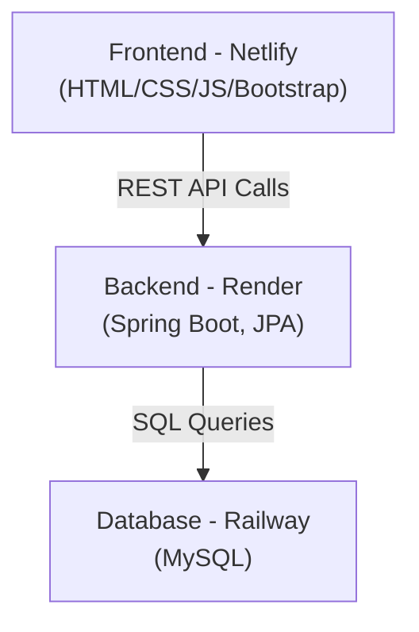

# 📚 Course Registration System – Backend


A **Backend Service** for a full-stack Course Registration System, built with **Spring Boot, MySQL, JPA/Hibernate**, and containerized with **Docker**.  
This backend powers the deployed frontend app:

🔗 **Live Frontend**: [Course Registration System](https://course-register-system.netlify.app)

⚠️ **Note:** This project is deployed on free-tier services (Render/Railway/Netlify).  
Because of the limitations of free plans (cold starts and restricted storage), the demo may take extra time to load or occasionally show errors.  
Once the backend services start running, the application works as expected.

---

## 🚀 Deployment Architecture

- **Backend API (Spring Boot)** → Deployed on [Render](https://render.com)  
- **Database (MySQL)** → Hosted on [Railway](https://railway.app)  
- **Frontend (HTML/JS)** → Deployed on [Netlify](https://netlify.com)  
- **API Testing** → Verified via Postman  

---

## 🏗️ System Architecture  



---

## ✨ Features

- 🔎 List all available courses  
- 📝 Register a student for a course  
- 👨‍🎓 View enrolled students  
- ✅ REST API architecture (tested with Postman)  
- ✅ Persistent storage with **MySQL + JPA/Hibernate**  
- ✅ Clean **Service & Repository layer** separation  
- ✅ Configurable environment via `application.properties`  
- ✅ **Dockerized** backend for easy deployment  

---

## 🛠️ Tech Stack

- **Language:** Java 17+  
- **Framework:** Spring Boot  
- **ORM:** Spring Data JPA / Hibernate  
- **Database:** MySQL (Railway)  
- **Build Tool:** Maven  
- **Deployment:** Render + Docker  

---

### 📸 Screenshots 
**API Testing**

**Backend Deployment**

**MySQL Deployment**


---

## 📂 Project Structure
```bash
course-backend/
│── src/main/java/com/example/Course/Registration/System
│ ├── controller/ # REST Controllers
│ ├── model/ # Entities (Course, CourseRegister)
│ ├── repository/ # Spring Data Repositories
│ ├── service/ # Business Logic Layer
│ └── CourseRegistrationSystemApplication.java
│
│── src/main/resources
│ ├── application.properties # Config (DB, ports, etc.)
│
│── Dockerfile
│── pom.xml
│── README.md
```

---

## ⚡ Setup Instructions

### 1️⃣ Clone the repository
```bash
git clone https://github.com/seshathri044/course-backend.git
cd course-backend
```
### 2️⃣ Configure Database
```bash
Update src/main/resources/application.properties with your DB credentials:
spring.datasource.url=jdbc:mysql://<RAILWAY_DB_HOST>:<PORT>/<DB_NAME>
spring.datasource.username=<DB_USER>
spring.datasource.password=<DB_PASS>
spring.jpa.hibernate.ddl-auto=update
spring.jpa.show-sql=true
```
### 3️⃣ Run with Maven (local dev)
```bash
mvn spring-boot:run
```
Backend will start at 👉 http://localhost:8080

### 4️⃣ Run with Docker
Build and run containerized backend:
docker build -t course-backend .
docker run -p 8080:8080 course-backend

---

## 🔗 API Endpoints

| Method | Endpoint            | Description              |
|--------|---------------------|--------------------------|
| GET    | `/courses`          | List all available courses |
| POST   | `/courses/register` | Register a student       |
| GET    | `/courses/enrolled` | View enrolled students   |

👉 Full API collection tested in **Postman**.


### 🔄 Repo Navigation

Frontend Repo 👉 [course-frontend](https://github.com/seshathri044/course-frontend)

Backend Repo 👉 [course-backend](https://github.com/seshathri044/course-backend)

### 🤝 Contributing
- Contributions are welcome!

### 📜 License
This project is licensed under the Apache-2.0 License – see the LICENSE file for details.
